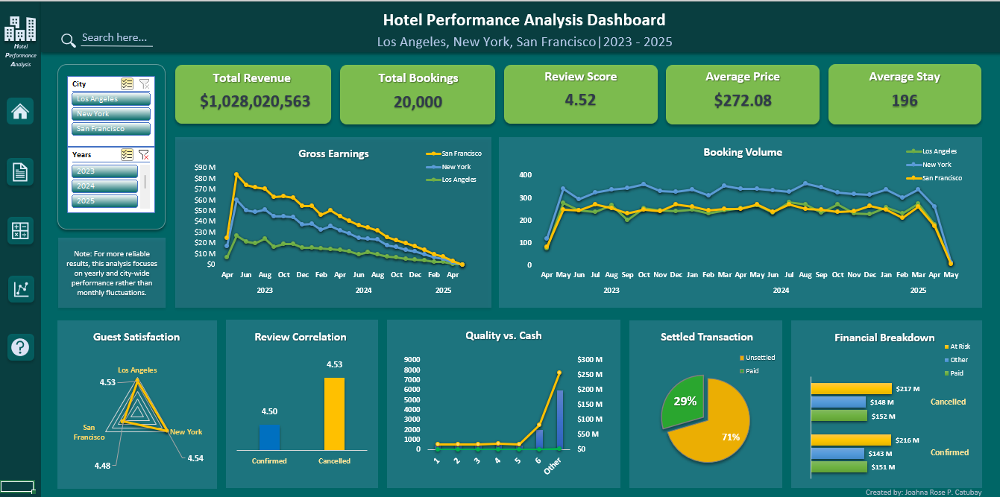

# Hotel-Performance-Analysis
Excel dashboard analyzing hotel booking performance across major U.S. cities.

## Project Overview
This project presents an end-to-end data analysis workflow using Excel, focusing on hotel booking performance across 
three major U.S. cities: San Francisco, Los Angeles, and New York. This project is divided into two parts: Part A for 
detailed data cleaning and preparation and Part B for dashboard and analysis.

## Part A: Data Integrity Audit & Optimization
- Standardized inconsistent date formats
- Removed duplicate records
- Handled missing and invalid values
- Validated calculated fields (e.g., number of nights)
  
## Part B: Operational Insights Dashboard
- Built an interactive dashboard using Pivot Tables, Pivot Charts and slicers
- Visualized booking trends, revenue, and customer satisfaction
- Implemented dynamic titles and filters
  
## Objectives
1. Prepare and conduct methodical cleaning on the dataset.
2. Perform analysis and calculations.
3. Create a dynamic and comprehensive dashboard and provide overall insights.

## Dataset Description
The dataset is a 22,000 hotel booking record across US cities, namely, San Francisco, Los Angeles, and New York. 
The data scope comprises guest identity, booking logistics, financial metrics, and operational status.

## Key Insights
- San Francisco generated the highest revenue.
- New York had the highest booking volume.
- Only 29% of revenue was settled, indicating a gap in payment completion.
- Cancelled bookings had minimal impact on review scores.

## Dashboard Preview

## Tools Used
1. Microsoft Excel
2. Pivot Tables, Pivot Charts, and Slicers
3. Data Cleaning Techniques
4. Data Visualization Tool

## Personal Reflection
This project  helped me develop my skill in organizing a project and creating a workflow for project efficiency. Dividing 
the project into two parts helped me build a detailed structure on every part. Part A strengthened my ability to clean and 
handle large dataset while Part B honed my visualization skills, making raw information into a dynamic, comprehensive, and 
interactive dashboard ready for analysis and client reporting. 

## Future Improvements
- Improve overall project efficiency.
- Apply machine learning for hotel booking predictions.
- Utilized other dashboarding techniques outside Microsoft Excel.

## Files Included
1. For full access to Project 1, please download the zipped file.
2. Navigate to "Project 1 Part B Operational Insights Dashboard" to view the final dashboard output.
3. For optimal viewing, please set your screen to full-screen mode.
- 
- 
- 

To make the project more accessible, PDF versions of the files are also provided. These do not display the entire
worksheet, but instead offer an overview of each sheet.
- 
- 

## Data Source
- Dataset Title: Dirty Data For Cleaning
- Website: Kaggle
- Author: Krithika
- Source Link: https://www.kaggle.com/datasets/krithi96/dirty-data-for-cleaning
- License: CC0: Public Domain

